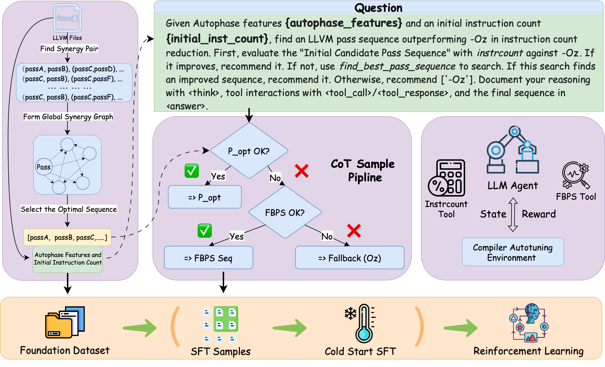

# Compiler-R1

Please refer to the [Installation.md](Installation-Ivan.md) for an step by step tutorial on installation.

**Compiler-R1** is the **first framework** that combines **Large Language Models (LLMs)** and **Reinforcement Learning (RL)** for compiler pass sequence auto-tuning targeting reducing LLVM IR instruction count. It leverages the reasoning ability of LLMs and the exploration power of RL to efficiently discover high-performance pass sequences.


---

## 🌟 Key Features

- ⚙️ **Pass Sequence Auto-Tuning**: Automatically finds optimized compiler pass sequences for LLVM IR instruction count.
- 🧠 **LLM + RL Synergy**: Combines pretrained language models and reinforcement learning agents for robust decision-making.
- 🔁 **SFT, PPO, and RPP Training Pipelines**: Supports multiple fine-tuning and RL methods.
- 🛠️ **External Tool Support**: Utilizes external tools to aid and enhance the compiler pass auto-tuning process.
- 📊 **CoT & Tool-Use Dataset**: Incorporates a dataset structured with Chain-of-Thought (CoT) and tool invocation.

---

## 🔧 Environment Setup

```bash
# Create and activate conda environment
conda create -n Compiler-R1 python==3.10
conda activate Compiler-R1

# Initialize and update submodules
git submodule update --init --recursive

# Install verl and other dependencies
cd verl
pip3 install -e .
cd .. 
pip3 install vllm
pip3 install flash-attn --no-build-isolation
pip3 install FlagEmbedding
pip3 install faiss-cpu
```

---

## 🧪 Training

To run **Experiment 1 and 2**, follow these steps:

### 1. Generate Dataset and Train GRPO

This script will generate the training dataset and train the GRPO model.

```bash
bash train_Exp_1_2.sh
```

### 2. Train Models with Different Methods

You can then train models using different strategies:

**PPO (Proximal Policy Optimization):**
```bash
bash train_Exp_1_ppo.sh
```

**RPP (Reward-weighted Preference Policy):**
```bash
bash train_Exp_1_rpp.sh
```

**SFT (Supervised Fine-Tuning):**
```bash
bash train_Exp_1_pureSFT.sh
```

---

## 🚀 Inference

After training your models, follow these steps for inference:

### For RL-based models (PPO, RPP):

1.  **Merge model weights:**
```bash
bash infer_model_merge.sh
```
2.  **Run inference:**
```bash
bash infer_xxxx.sh
```
            
### For SFT models:

SFT models do not require a merge step. You can run inference directly:

```bash
bash infer_xxxx.sh
```

⚠️ **Important**: Make sure to correctly set paths inside each inference script (`infer_xxxx.sh`) to point to your trained models and data.

## Citation
If you use Compiler-R1 in your research or find it useful, please cite our paper:

```bash
@misc{pan2025compilerr1agenticcompilerautotuning,
  title={Compiler-R1: Towards Agentic Compiler Auto-tuning with Reinforcement Learning}, 
  author={Haolin Pan and Hongyu Lin and Haoran Luo and Yang Liu and Kaichun Yao and Libo Zhang and Mingjie Xing and Yanjun Wu},
  year={2025},
  eprint={2506.15701},
  archivePrefix={arXiv},
  primaryClass={cs.LG},
  url={https://arxiv.org/abs/2506.15701}
}
```

## Acknowledgements
This repo benefits from [Agent-R1](https://github.com/0russwest0/Agent-R1). Thanks for their wonderful works.
